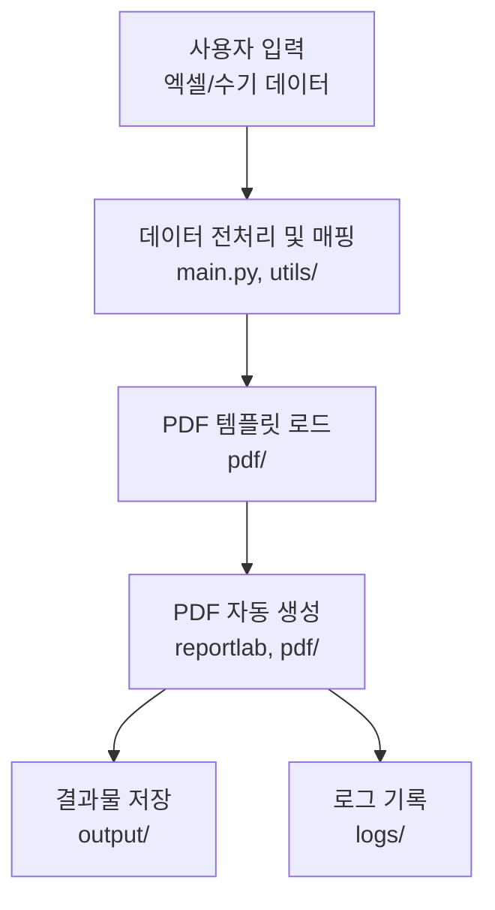

# PDF 사무자동화

PDF 문서 자동화 도구입니다. 이 프로그램은 PDF 양식을 자동으로 채우고 관리하는 기능을 제공합니다.

## 주요 기능

- PDF 양식 자동 채우기
  - 템플릿 기반 자동 입력
  - 다중 PDF 동시 처리
  - 사용자 정의 필드 매핑
- 회사별 폴더 자동 생성 및 관리
  - 회사 정보 기반 폴더 구조화
  - 파일 자동 분류
- 라이선스 관리 시스템
  - 사용자 인증
  - 라이선스 키 관리
  - 사용 기간 제한
- 사용자 친화적인 GUI 인터페이스
  - 직관적인 작업 흐름
  - 진행 상황 실시간 표시
  - 오류 메시지 및 알림

## 설치 방법

1. 최신 릴리즈 버전을 다운로드합니다.
   - [릴리즈 페이지](https://github.com/Thunder-punch/PDF_auto/releases)에서 최신 버전 확인
2. 설치 파일을 실행합니다.
3. 설치 마법사의 지시를 따릅니다.

### 설치 실패 시 해결 방법

1. 관리자 권한으로 실행
2. 안티바이러스 프로그램 일시 중지
3. 이전 버전 완전 제거 후 재설치
4. [자세한 문제 해결 가이드](설치실패시_꼭_읽어_주세요.txt) 참조

## 시스템 요구사항

- Windows 10 이상
- 최소 4GB RAM
- 500MB 이상의 하드디스크 여유 공간
- Python 3.8 이상 (개발용)

## 개발 환경 설정

1. 저장소를 클론합니다:
```bash
git clone https://github.com/Thunder-punch/PDF_auto.git
```

2. 가상환경을 생성하고 활성화합니다:
```bash
python -m venv venv
.\venv\Scripts\activate
```

3. 필요한 패키지를 설치합니다:
```bash
pip install -r requirements.txt
```

## 프로젝트 구조 및 데이터 흐름

### 디렉토리 구조

```
PDF_auto/
├── main.py              # 메인 실행 파일
├── utils/              # 유틸리티 함수들
├── ui/                 # 사용자 인터페이스 관련 코드
├── resources/          # 리소스 파일들 (로컬 전용)
├── pdf/               # PDF 관련 처리 코드
├── output/            # 생성된 PDF 저장 폴더
├── logs/              # 로그 파일 저장 폴더
└── config.json        # 설정 파일
```

### 파일 연결 구조도

```
main.py (메인 진입점)
├── utils/
│   ├── config.py          # 버전, 리소스 경로 등 설정
│   └── ...               # 기타 유틸리티 함수들
├── ui/
│   └── main_screen.py    # 메인 GUI 화면 (App 클래스)
├── resources/
│   └── fonts/           # 폰트 파일들 (NanumGothic.ttf 등)
└── 외부 라이브러리
    ├── reportlab        # PDF 생성 라이브러리
    ├── tkinter         # GUI 라이브러리
    └── logging         # 로깅 시스템
```

주요 기능 흐름:
1. 프로그램 시작 (main.py)
   - 하드웨어 ID 확인
   - 라이선스 검증
   - 로깅 시스템 초기화
2. GUI 실행 (ui/main_screen.py)
   - 메인 화면 표시
   - 사용자 입력 처리
3. PDF 처리 (pdf/ 디렉토리)
   - 템플릿 로드
   - 데이터 매핑
   - PDF 생성
4. 결과 저장 (output/ 디렉토리)
   - 생성된 PDF 저장
   - 로그 기록

### 데이터/파일 흐름도



## 사용 방법

1. 프로그램 실행
2. 회사 정보 입력
3. PDF 템플릿 선택
4. 데이터 입력 또는 Excel 파일 업로드
5. 자동 생성 시작

## 문제 해결

- 로그 파일 확인: `logs/` 폴더
- 설정 파일 확인: `config.json`
- 자주 발생하는 오류와 해결 방법은 [문제 해결 가이드](설치실패시_꼭_읽어_주세요.txt) 참조

## 기여 방법

1. 이슈 등록
2. Fork 후 개발
3. Pull Request 생성

## 라이선스

이 프로젝트는 개인 및 기업용으로 사용 가능합니다.
- 상업적 사용 가능
- 수정 및 배포 가능
- 개인정보 보호 규정 준수

## 버전 정보

현재 버전: v1.2.1
- PDF 양식 자동 채우기 기능 개선
- 사용자 인터페이스 업데이트
- 성능 최적화

## 연락처

- 이메일: texclaim@naver.com
- GitHub: [Thunder-punch](https://github.com/Thunder-punch) 